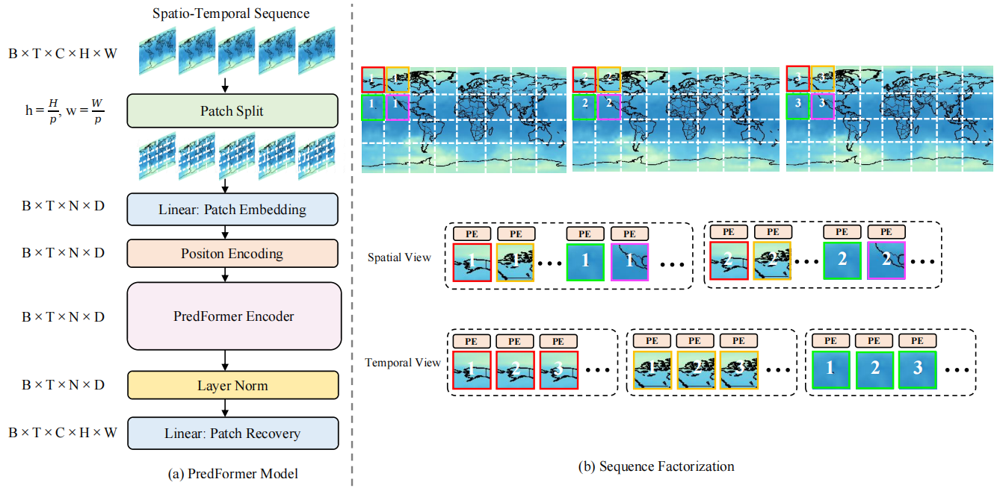
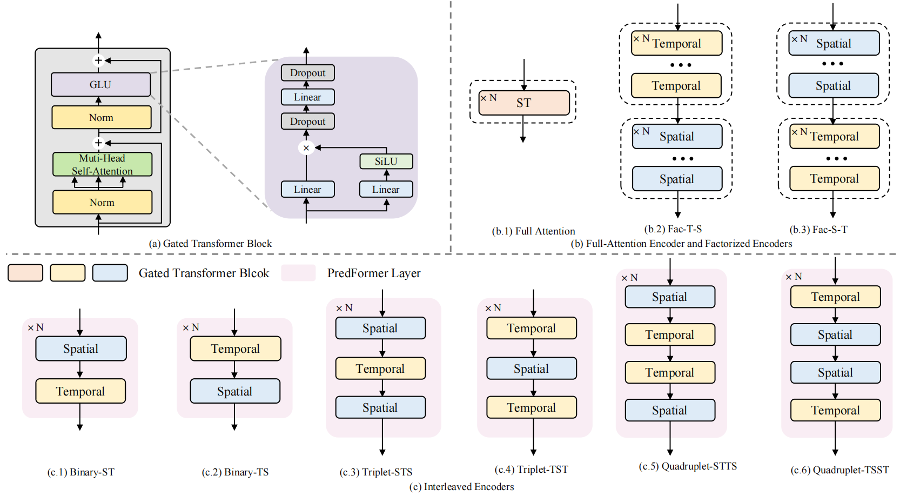
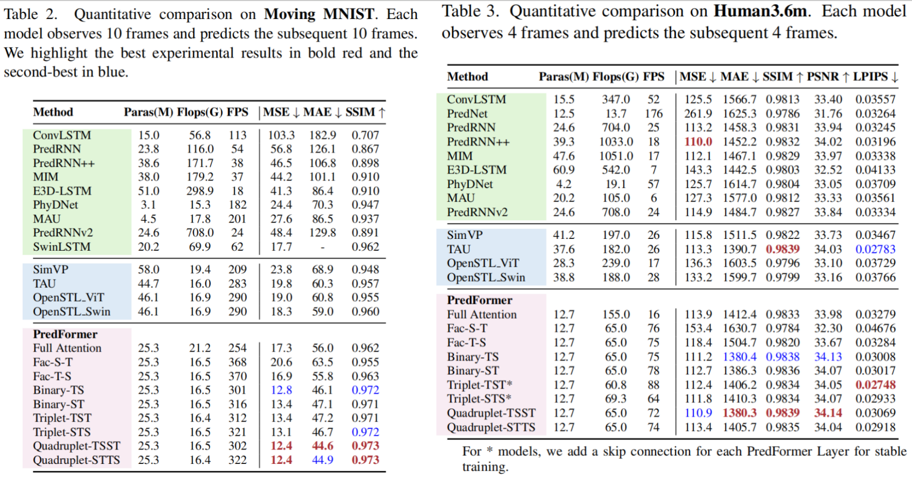
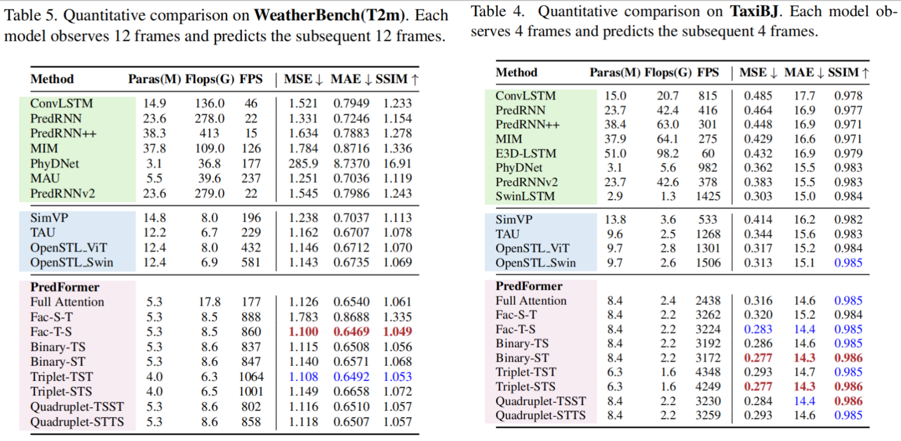
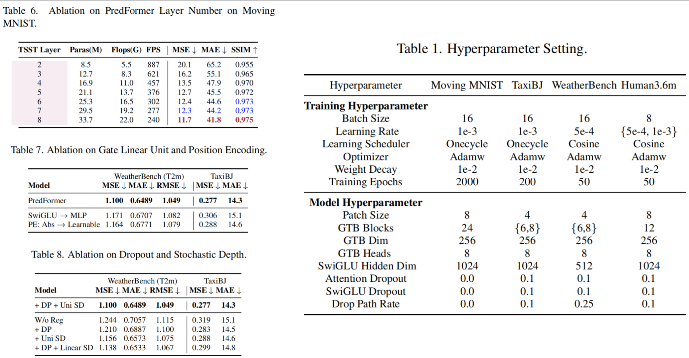

# PredFormer: Video Prediction Transformers without Recurrence or Convolution

Official repository for PredFormer: Video Prediction Transformers without Recurrence or Convolution. [Arxiv](https://arxiv.org/abs/2410.04733) [Project Page](https://yyyujintang.github.io/predformer-project/)

*2025.03*: &nbsp; We add more datasets and baselines. We release PredFormer code and training scripts, please feel free to try!

## Overview

We propose PredFormer, a pure gated transformer-based framework for video prediction. By eliminating the inductive biases inherent in CNNs, PredFormer harnesses the scalability and generalization capabilities of the transformers, achieving significantly enhanced performance ceilings with efficiency. We perform an in-depth analysis of spatial-temporal transformer factorization, exploring full-attention encoders and factorized encoders along with interleaved spatiotemporal transformer architectures, resulting in nine PredFormer variants. These variants address the differing spatial and temporal resolutions across tasks and datasets for optimal performance.

Extensive experiments demonstrate the state-of-the-art performance of PredFormer on Moving MNIST, TaxiBJ, WeatherBench, and Human3.6m. The significant improvements in both accuracy and efficiency highlight the potential of PredFormer as a strong baseline for real-world video prediction applications.




## Installation

```
# Exp Setting: PyTorch: 2.1.0+ Python 3.10
conda env create -f environment.yml  
conda activate predformer
pip install -e .
pip install tensorboard einops
```

## Overview

- `data/:` contains Moving MNIST/Human3.6m/TaxiBJ/Weatherbench dataset. Download (tools/prepare_data).
- `openstl/methods/PredFormer.py:` contains the defined training method of PredFormer.
- `openstl/models:` contains 9 PredFormer Variants including FullAttention, FacST, FacTS, BinaryTS, BinaryST, Triplet_TST, Triplet_STS, Quadruplet_TSST, Quadruplet_STTS. **Please modify openstl/models/__init__.py to choose a specific PredFormer model.**
- `scripts:` contains single GPU training scripts for Moving MNIST/Human3.6m/TaxiBJ/Weatherbench. We provide the script of the best PredFormer model.
- `configs` contains training configs for Moving MNIST/Human3.6m/TaxiBJ/Weatherbench. **Please modify Ndepth for different PredFormer models.**

## Train

```
# Moving MNIST
bash scripts/mmnist/mm_PredFormer_TSST_train.sh
# Human3.6m
bash scripts/human/human_PredFormer_TSST_train.sh
# TaxiBJ
bash scripts/taxibj/taxibj_PredFormer_STS_train.sh
# WeatherBench
bash scripts/weather/weather_PredFormer_FacTS_train.sh
```





## Acknowledgments

Our code is based on [OpenSTL](https://github.com/chengtan9907/OpenSTL). We sincerely appreciate for their contributions.

## Citation

If you find this repository useful, please consider citing our paper:

```python
@article{tang2024predformer,
  title={Video Prediction Transformers without Recurrence or Convolution},
  author={Yujin Tang and Lu Qi and Fei Xie and Xiangtai Li and Chao Ma and Ming-Hsuan Yang},
  booktitle={arXiv preprint arxiv:2410.04733},
  year={2025}
}
```
